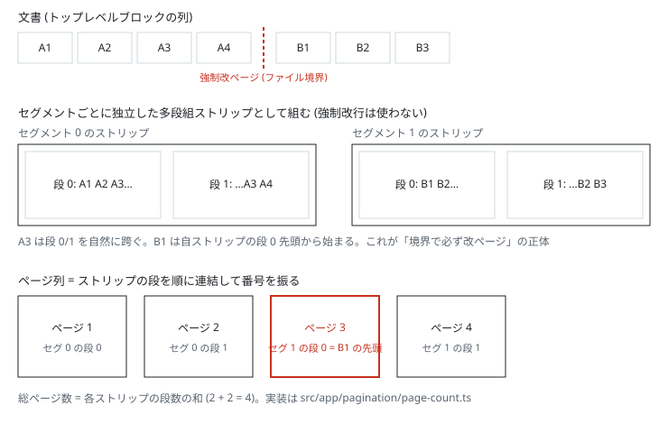
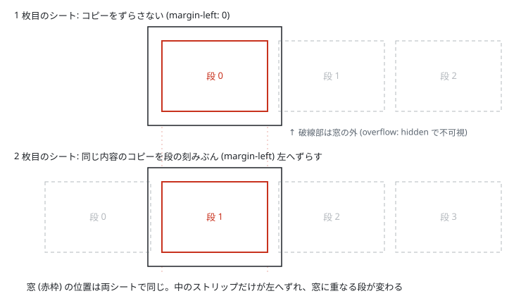

# printmd

Markdown 原稿を GitHub のレンダリングそのままの見た目で A4 の紙面に割り付け、改ページを調整して印刷用 PDF にするウェブツール。

**https://printmd.lacolaco.app**

- 計算はすべてブラウザ内で完結する。原稿がサーバーへ送られることはない
- 複数の Markdown ファイルを取り込み、順序を並べ替えられる (ファイル境界は常に改ページ)
- 任意のブロックの直前に改ページを指定できる。原稿は書き換わらない
- 出力はブラウザの印刷ダイアログから PDF に保存する

## 仕組み

「プレビューと印刷結果のページ割りが一致する」ことがこのツールの中核保証である。一致は予測ではなく共有で達成する: 画面のページ分割も印刷のページ分割も、同じブラウザの同じフラグメンテーションエンジンに行わせる。

### 自然な流し込み: CSS 多段組の流用

ブラウザのフラグメンテーションエンジンは、印刷 (`@page`) だけでなく CSS 多段組でも同じコードで内容を「収まる単位」に割る。そこで画面では本文を `column-width: 178mm; height: 265mm` (A4 の版面) の多段組コンテナに流し込む。段の寸法が印刷の版面と一致するため、段 i の中身 = 印刷時のページ i の中身になる。改ページ位置を自前で計算することは一切ない — orphans/widows や表の行分割などの規則ごと、実際に印刷を行うエンジンの分割結果をそのまま表示する。

### 強制改ページ: セグメント分割

強制改ページ (ファイル境界とパネルでの指定) は、画面では CSS の強制改行 (`break-before: column`) を使わずに表現する。Firefox は段への強制改行を実装しておらず、Safari 安定版も `break-before: column` を解さないためである。

代わりに文書を強制改ページ位置で「セグメント」(連続するトップレベルブロックの範囲) に分割し、セグメントごとに独立した多段組ストリップとして組む。各ストリップは必ず自分の段 0 の先頭から始まるので、「セグメント先頭 = ページ先頭」が構造として成立する。ページ列はストリップの段を順に連結したもので、総ページ数は各ストリップの段数の和になる。



印刷側は 1 本の文書のまま、境界ブロックの `break-before: page` (全エンジン対応) で割る。

### シート表示: 窓化

多段組の段は横に並ぶため、縦に積む紙の見た目はクリッピングで作る。各シート (白い A4) の版面位置に `overflow: hidden` の窓を開け、その中に自セグメントのストリップの複製を入れて、`margin-left: -(段位置 × 194mm)` だけ左へずらす。窓から見えるのはちょうど 1 段 = 1 ページ分になる。



複製をシートごとに持つメモリコストは、IntersectionObserver による遅延実体化 (可視域のシートだけ中身を作る) で抑えている。

### 検証

プレビューの段組ジオメトリから求めた「各見出しが載るページ」と、実際の印刷出力 (`page.pdf`) から抽出した同じ対応表の完全一致を e2e (Playwright) で常時検証している。強制改ページの境界がページ先頭に載ることは Chromium / WebKit / Firefox の 3 エンジンで検証する。

## 開発

```bash
npm ci
npm start          # 開発サーバー
npm test           # ユニットテスト (vitest / jsdom)
npm run e2e        # e2e (Playwright。プレビューと印刷 PDF の一致を実出力で検証)
npm run build      # 本番ビルド
```

デプロイは Cloudflare Workers Static Assets (`wrangler.jsonc`)。main への push で GitHub Actions が自動デプロイする。

## ライセンス

[MIT](LICENSE)
