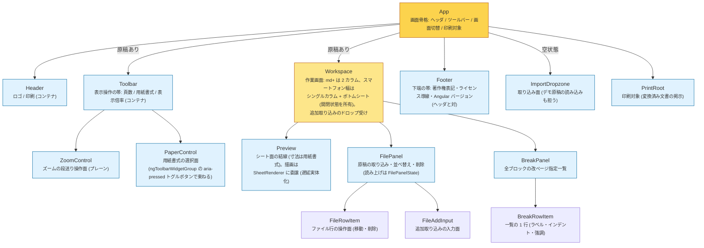

# コンポーネントツリー

各コンポーネントの配置と責務。トップレベルは `src/app/feature/` (機能 = header / workspace / import / print / footer) と `src/app/shared/` (機能横断のドメイン) の 2 つ。feature 内のディレクトリ構造はこのツリーの親子関係をそのまま写し、コンポーネントの協力オブジェクト (SheetRenderer など) とコンテナのビューモデル (`xxx.vm.ts`) は、それを使うコンポーネントと同じディレクトリに置く。状態とその操作は責務単位のドメインサービス (Manuscripts / Breaks / ConversionPipeline / Paper / Zoom) が一体で保有し、shared のドメインディレクトリに置く。
**コンポーネントの追加・削除・責務変更のコミットでは、この図と docs/signal-graph.md を同じコミットで更新すること** (CLAUDE.md の生きたドキュメント規則)。

- 画面領域の責務で階層化: App は骨格、Workspace が作業画面と右カラム (調整パネル) を所有する
- コンテナは自身のビューモデル (CQS: state query と command) だけを注入し、VM がドメインサービス (Manuscripts / Breaks / ConversionPipeline / Paper / Zoom) を仲介する。プレーンなコンポーネントは input/output だけで疎通し VM を持たない。input/output は FileAddInput の selected など最小限
- Toolbar は表示操作 (頁数 / 用紙書式 / 表示倍率) をヘッダから切り出した独立の帯で、原稿があるときだけ App が Header の下・Workspace の上に置く。ヘッダは Header の isActive (原稿有無) が出し分ける印刷ボタンだけを持つ
- リアクティブ構造は [signal-graph.md](./signal-graph.md) を参照
