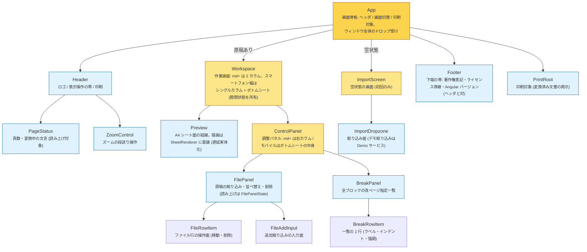

# コンポーネントツリー

各コンポーネントの配置と責務。`src/app/components/` のディレクトリ構造はこのツリーの親子関係をそのまま写す (親コンポーネントのディレクトリ配下に子コンポーネントを置く。App 直下の葉は components/ 直下)。コンポーネントの協力オブジェクト (SheetRenderer / Demo など、コンポーネントではないクラス) は、それを使うコンポーネントと同じディレクトリに置く。状態とその操作は責務単位のドメインサービス (Manuscripts / Breaks / Document / Zoom) が一体で保有し、ドメインのディレクトリに置く。ローカルステートは提供元コンポーネントに同居する (workspace.state.ts / file-panel.state.ts)。
**コンポーネントの追加・削除・責務変更のコミットでは、この図と docs/signal-graph.md を同じコミットで更新すること** (CLAUDE.md の生きたドキュメント規則)。

- 画面領域の責務で階層化: App は骨格、Workspace / ImportScreen が画面、ControlPanel が右カラムを所有する
- コンポーネント間の疎通はドメインサービス (Manuscripts / Breaks / Document / Zoom) の購読と命令で行う。input/output は FileAddInput の selected など最小限
- リアクティブ構造は [signal-graph.md](./signal-graph.md) を参照
