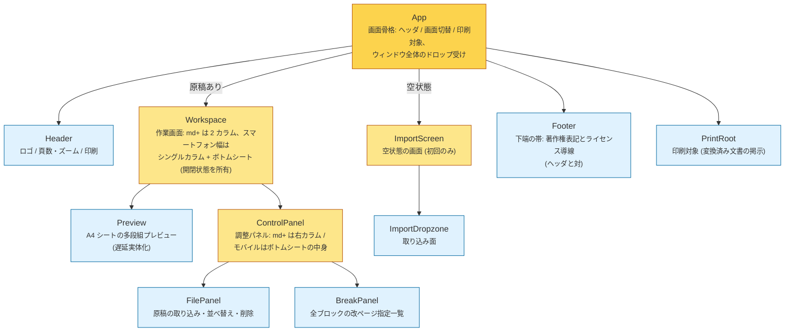

# コンポーネントツリー

各コンポーネントの配置と責務。**コンポーネントの追加・削除・責務変更のコミットでは、この図と docs/signal-graph.md を同じコミットで更新すること** (AGENTS.md の Living documentation 規則)。

- 画面領域の責務で階層化: App は骨格、Workspace / ImportScreen が画面、ControlPanel が右カラムを所有する
- コンポーネント間の疎通はすべて共有サービス (EditorStore / ViewerState) 経由で、input/output は存在しない (該当ユースケースがない)
- リアクティブ構造は [signal-graph.md](./signal-graph.md) を参照
