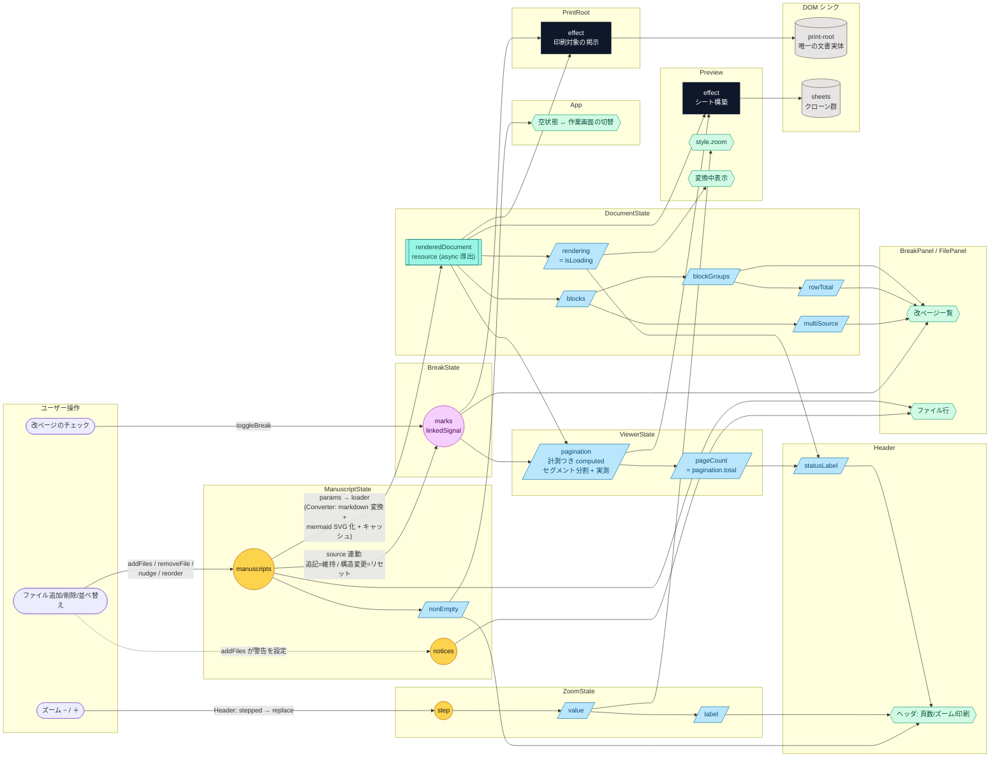

# signal 依存グラフ

アプリ全体のリアクティブ構造。**構造 (signal / computed / effect / コンポーネント構成) を変えるコミットでは、この図も同じコミットで更新すること。**

- 逆流 (effect からの signal 書き込み)・循環: なし
- `renderedDocument` は resource: ManuscriptState.files を params とする async 導出 (Converter サービスが markdown 変換 + mermaid SVG 化 + キャッシュを担う)。`rendering` はその isLoading
- `pagination` は (doc, breaks) からの計測つき computed。強制改ページ位置で文書をセグメント (独立した段組ストリップ) に分割し、セグメントごとに実測する (プローブは観測可能な状態を残さない)。`pageCount` はその total
- `marks` は linkedSignal: ManuscriptState.files に連動し、末尾への追記では維持・構造変更ではリセット
- パネル内で完結するローカル UI state (dragOver / draggingIndex / Announcer の message) は省略
- ズーム段の状態は `ZoomState` (index / value / label)。段送り・上限判定・初期段の決定は pagination/zoom.ts の純関数で、Header が判断して replace で置き換える

凡例: 丸 = writable signal ・ 紫丸 = linkedSignal ・ 青緑 = resource (async 導出) ・ 平行四辺形 = computed ・ 黒 = effect (DOM 書き込みのみ) ・ 六角 = テンプレートバインディング ・ 点線 = 命令的な書き込み
