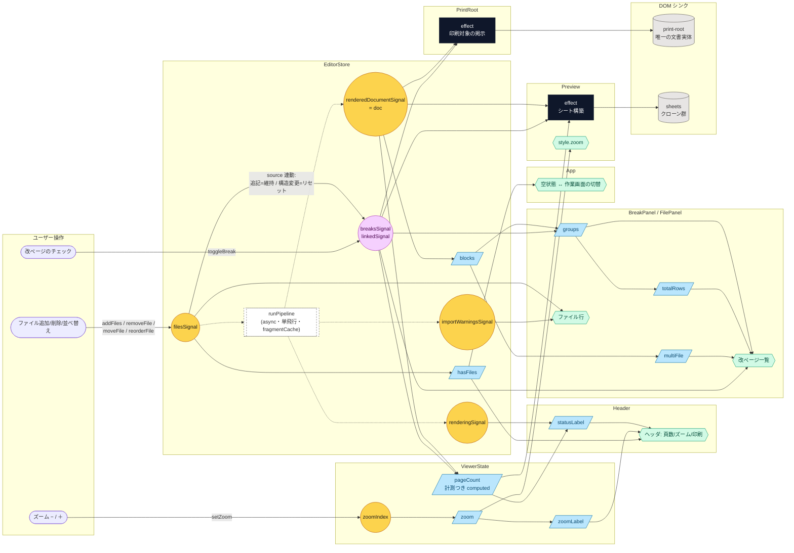

# signal 依存グラフ

アプリ全体のリアクティブ構造。**構造 (signal / computed / effect / コンポーネント構成) を変えるコミットでは、この図も同じコミットで更新すること。**

- 逆流 (effect からの signal 書き込み)・循環: なし
- `pageCount` は (doc, breaks) からの計測つき computed (プローブは観測可能な状態を残さない)
- `breaksSignal` は linkedSignal: filesSignal に連動し、末尾への追記では維持・構造変更ではリセット
- `filesSignal → runPipeline → renderedDocumentSignal` は async パイプライン (点線 = 非リアクティブ)。単飛行 + 後追いで再入制御
- パネル内で完結するローカル UI state (dragOver / draggingIndex / announcement) は省略

凡例: 丸 = writable signal ・ 紫丸 = linkedSignal ・ 平行四辺形 = computed ・ 黒 = effect (DOM 書き込みのみ) ・ 六角 = テンプレートバインディング ・ 点線 = 命令的 (非リアクティブ)
