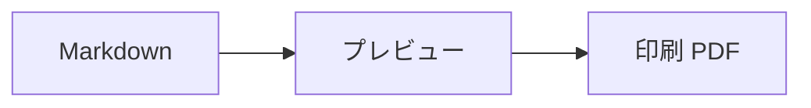

# printmd の使い方

このサンプルは printmd の機能を一通り試すためのデモ原稿である。GitHub のレンダリングと同じ見た目で A4 に割り付けられ、右のパネルで任意のブロックの直前に改ページを指定できる。原稿そのものは書き換わらない。

## できること

- 複数の Markdown ファイルの取り込みと並べ替え (ファイル境界は常に改ページ)
- 任意のブロックの直前への改ページ指定
- ブラウザの印刷ダイアログからの PDF 保存 (プレビューとページ割りが一致する)

## 体裁の見本

インラインコード `const x = 1` 、**強調**、[リンク](https://printmd.lacolaco.app)、~~打ち消し~~。

```ts
function greet(name: string): string {
  return `こんにちは、${name}`;
}
```

| 機能 | 状態 |
| --- | --- |
| GitHub スタイル | 対応 |
| シンタックスハイライト | 対応 |
| mermaid | 対応 |

- [x] 済んだタスク
- [ ] これからのタスク



> 引用ブロック。紙面の見た目はこのプレビューのまま印刷される。

## 次のファイルへ

このデモにはもう 1 ファイル、著作権消滅作品の「走れメロス」(太宰治、青空文庫) が入っている。ファイル境界で自動的に改ページされること、長い本文の自然な改ページを右のパネルで動かせることを確かめてほしい。
